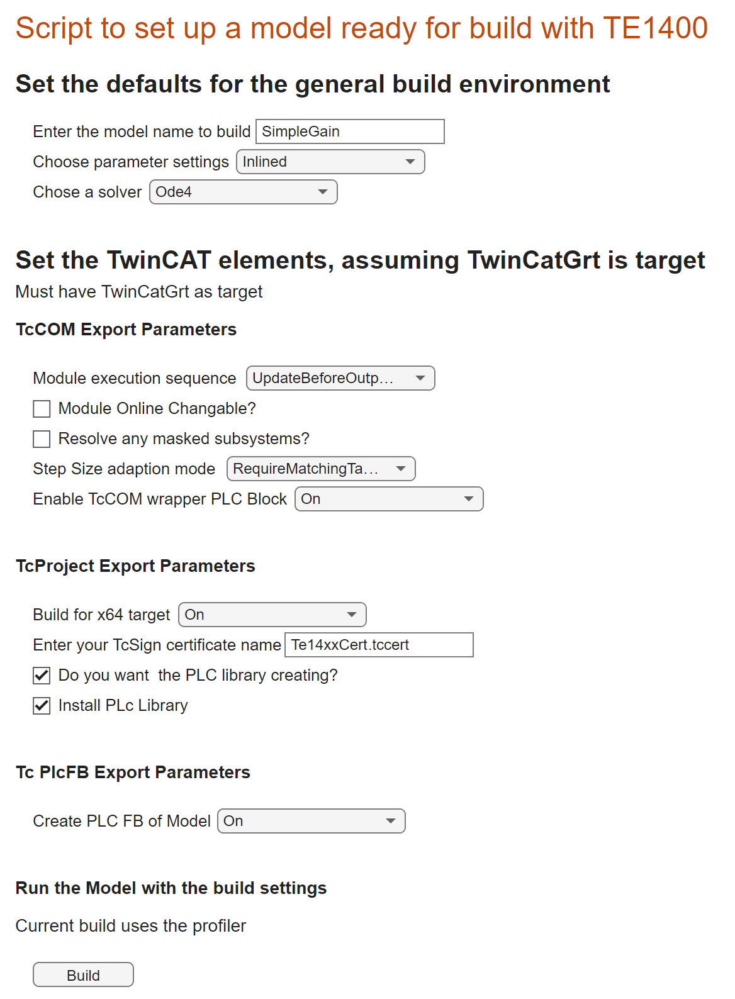

# Build your Simulink model for Deployment in TwinCAT RT

## Overview

It is possible to parameterise the build of a Simulink module using the Simulink coder tool options menus. This can take a lot of time and requires effort, especially if you are building a number of models or changing the parameters regularly. This live script semi automates the process.

This script allows you to parameterise a given model selectable in the first text box tool.

## Requirements

This demonstration was built and tested with R2022a. It will likely mostly run in R2021a and R2021b.

TE14xx 2.3.1.0
TC4024.20

## Instructions
* Open the Live Script, SetForTwinCATGrt.mlx file.

Select the options required for the build and hit the Build button.

