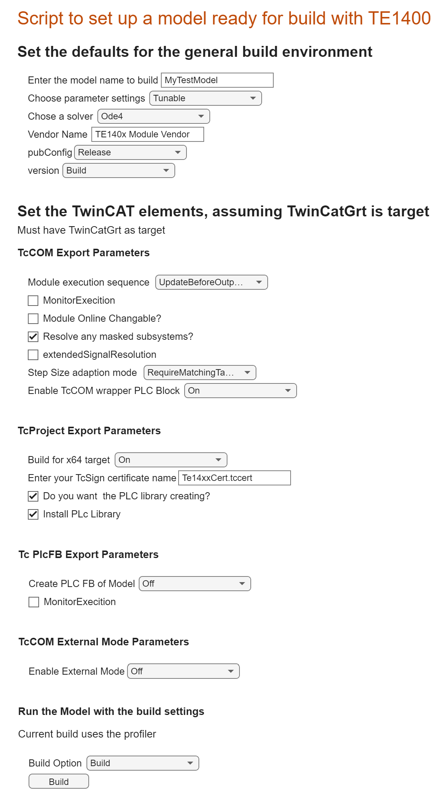

# Build your Simulink model for Deployment in TwinCAT RT

## Overview

It is possible to parameterise the build of a Simulink module using the Simulink coder tool options menus. This can take a lot of time and requires effort, especially if you are building a number of models or changing the parameters regularly. This live script semi automates the process. It will also give you a base sample for how you would go about automating your build and deployment.

This script allows you to parameterise a given model selectable in the first text box tool.

## Requirements

This demonstration was built and tested with R2022a. It will likely mostly run in R2021a and R2021b.

TE14xx 2.3.1.0
TC4024.20

## Instructions
* Open the Live Script, SetForTwinCATGrt.mlx file.
* Select the options required for the build 
* hit the Build button.

<mark>If you are building for a 64bit system make sure to specifiy your own driver signing certificate.</mark>

<mark>Be aware that you will need to enable the TcCOM wrapper or PLC FB to create a PLC library.</mark>

## Contributing

If you would like to ontribute thats great, this is a developing project.
As a tip to find out what you have access to get the object params from your model:

get_param('YourModelName','ObjectParameters');

for example

get_param('MyTestModel','ObjectParameters');

replace 'MyTestModel' with your model name.

* fork the repo, 
* branch 
* make your changes
* submit a PR

